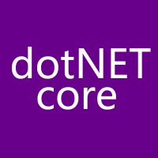
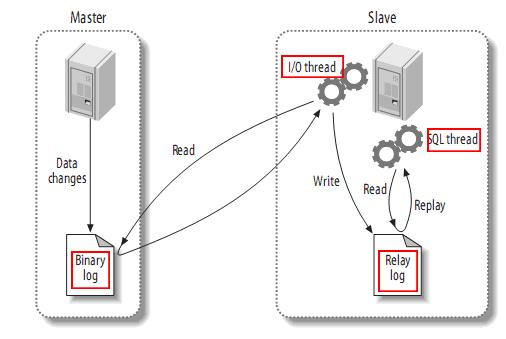
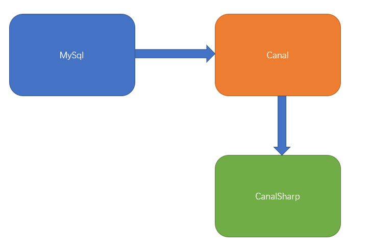

# 介绍

在数据库中，**更改数据捕获**（**CDC**）是一组软件设计模式，用于确定和跟踪已更改的数据，以便可以使用已更改的数据来采取措施。CanalSharp 是阿里巴巴开源项目 mysql 数据库 binlog 的增量订阅&消费组件 Canal 的 **.NET 客户端**，Canal 是 mysql 数据库的一种 cdc 组件。

> Wiki: [Change data capture](https://en.wikipedia.org/wiki/Change_data_capture)

项目发起与维护人：[李志强](https://github.com/stulzq)、[付金林](https://github.com/withlin)

当前版本： 

开源地址：<https://github.com/dotnetcore/CanalSharp>

CanalSharp 是 .NET Core Community 旗下的项目

## 1.分支说明

| 分支          | 说明                                                         |
| ------------- | ------------------------------------------------------------ |
| release/0.2.0 | CanalSharp的最初是版本，自Canal的Java Client而来，带有不少Java的代码习惯，采用 .NET 原生 Socket 实现，不再维护 |
| main          | 目前开发和维护的主要分支，全新代码实现。                     |

## 2.Canal 简单介绍

早期阿里巴巴因为杭州和美国双机房部署，存在跨机房同步的业务需求，实现方式主要是基于业务 trigger 获取增量变更。从 2010 年开始，业务逐步尝试数据库日志解析获取增量变更进行同步，由此衍生出了大量的数据库增量订阅和消费业务。

基于日志增量订阅和消费的业务包括

- 数据库镜像
- 数据库实时备份
- 索引构建和实时维护(拆分异构索引、倒排索引等)
- 业务 cache 刷新
- 带业务逻辑的增量数据处理

当前的 canal 支持源端 MySQL 版本包括 5.1.x , 5.5.x , 5.6.x , 5.7.x , 8.0.x

### MySQL主备复制原理

- MySQL master 将数据变更写入二进制日志( binary log, 其中记录叫做二进制日志事件binary log events，可以通过 show binlog events 进行查看)
- MySQL slave 将 master 的 binary log events 拷贝到它的中继日志(relay log)
- MySQL slave 重放 relay log 中事件，将数据变更反映它自己的数据

### Canal 工作原理

- canal 模拟 MySQL slave 的交互协议，伪装自己为 MySQL slave ，向 MySQL master 发送dump 协议
- MySQL master 收到 dump 请求，开始推送 binary log 给 slave (即 canal )
- canal 解析 binary log 对象(原始为 byte 流)

更详细介绍请查阅 Canal 官方文档：https://github.com/alibaba/canal

## 3.CanalSharp 工作原理

canal 设计了 client-server 模式，交互协议使用 protobuf 3.0 , client 端可采用不同语言实现不同的消费逻辑。而 CanalSharp 正是 .NET/C# Client 实现，可以采用 C# 编写业务代码来消费 MySql binlog 数据。

